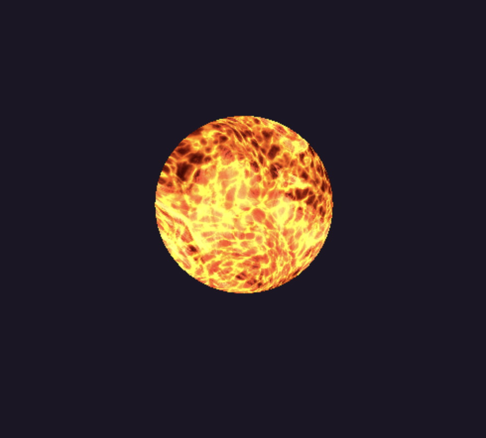

# THREE JS SUN using Shaders written in GLSL and Exploring Fractal Brownian Motion (FBM)

Learning about shaders and developing 3D Art on the broswer. 

This project was a way to explore Fractal Brownian Motion as well as vertex and fragmet shaders. 

Run using "npx vite". 

